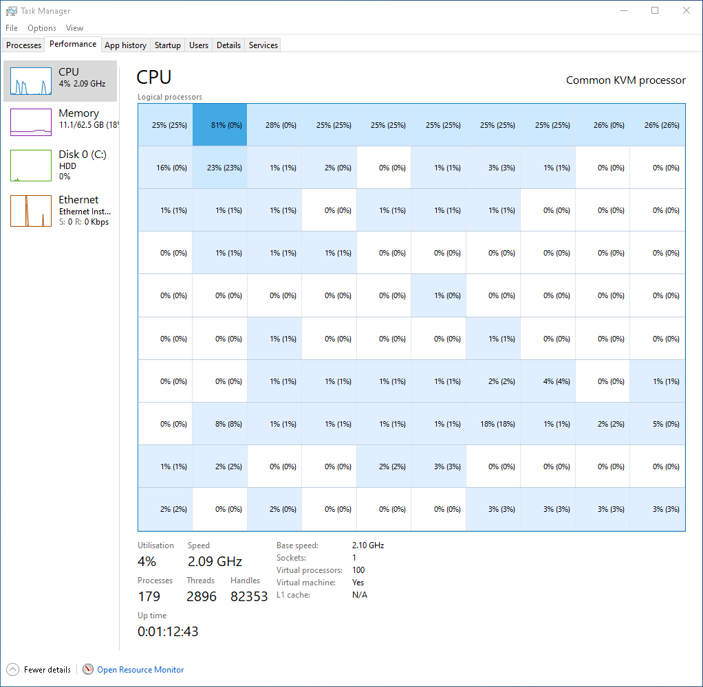

# CPU Painter

Use the Windows Task Manager CPU view as a bitmap.

Inspired by Mark Russinovich [TaskManagerBitmap](https://github.com/markrussinovich/TaskManagerBitmap).

This was just to get started learning Rust, so dont expect any good code.

What does it look like?

## Usage

The `generate_font.py` generates a font bitmap for every printable ASCII char. You will need to generate the right font size for the bitmap you wanna render.

For example the one shipped with this repository is for a 100 cores (10x10 pixels).

Once the font.rs is generated correctly for your setup just `cargo run` and hope for the best!

Have fun!